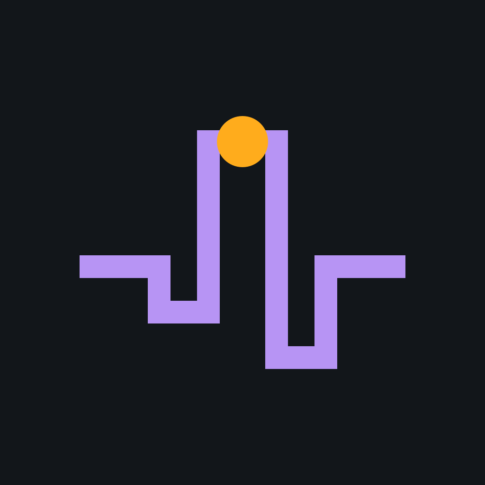

# SessionPulse

  

  <b>Gentle session health reminders, playtime tracking, and optional session limits for PaperMC, Spigot &amp; Folia.</b>

  
  
  
  

Part of the [Ninja6-MC](https://github.com/Ninja6-MC) plugin suite.

---

## Status

🚧 **Under Development** — not yet released.

---

## What it does

SessionPulse watches how long each player has been online and sends configurable,
non-intrusive health reminders — hydration, posture, eye breaks — at milestones
you define. It never kicks anyone by default; enforcement is an optional layer for
servers that want structured rest breaks (families, schools, wellness communities).

### Features (planned)

- **Configurable milestones** — any number of one-time alerts keyed by session minute.
- **Recurring overtime** — optional repeating reminders after a threshold (marathon safety net).
- **Optional enforcement** — graceful disconnect + rejoin cooldown, disabled by default.
- **AFK-aware** — pauses the session clock when idle (EssentialsX hook or built-in detection).
- **Multi-platform** — Paper, Spigot, Purpur, Folia via FoliaLib + Adventure.
- **Rich formatting** — MiniMessage on all platforms, action bar, sound, optional title.
- **Folia-ready** — region-safe schedulers throughout.

---

## Brand Assets

Brand and identity assets are located under [`docs/assets/`](docs/assets/README.md), generated from [`icon-master.svg`](docs/assets/icon-master.svg) via [`scripts/export-icons.mjs`](scripts/export-icons.mjs) per the [Ninja6-MC Brand Identity System](https://github.com/Ninja6-MC/brand).

---

## License

[GNU General Public License v3.0](LICENSE).
