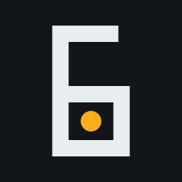

# SessionPulse

  <picture>
    <source media="(prefers-color-scheme: dark)" srcset="docs/assets/icon-transparent-dark.svg">
    
  </picture>

  <b>Gentle session health reminders, playtime tracking, and optional session limits for PaperMC, Spigot &amp; Folia.</b>

  

Part of the [Ninja6-MC](https://github.com/Ninja6-MC) plugin suite.

---

## Status

🚧 **Under Development** — not yet released.

---

## What it does

SessionPulse watches how long each player has been online and sends configurable,
non-intrusive health reminders — hydration, posture, eye breaks — at milestones
you define. It never kicks anyone by default; enforcement is an optional layer for
servers that want structured rest breaks (families, schools, wellness communities).

### Features (planned)

- **Configurable milestones** — any number of one-time alerts keyed by session minute.
- **Recurring overtime** — optional repeating reminders after a threshold (marathon safety net).
- **Optional enforcement** — graceful disconnect + rejoin cooldown, disabled by default.
- **AFK-aware** — pauses the session clock when idle (EssentialsX hook or built-in detection).
- **Multi-platform** — Paper, Spigot, Purpur, Folia via FoliaLib + Adventure.
- **Rich formatting** — MiniMessage on all platforms, action bar, sound, optional title.
- **Folia-ready** — region-safe schedulers throughout.

---

## Brand Assets

Two directories hold artwork, and they have opposite rules.

[`docs/assets/`](docs/assets/README.md) is **this repository's own** icon suite, authored
here and generated from [`icon-master.svg`](docs/assets/icon-master.svg) via
[`scripts/export-icons.mjs`](scripts/export-icons.mjs). Edit the master and re-export; do
not edit a generated file.

[`assets/`](assets/) holds the **shared organisation marks** and is **machine-managed**.
It is delivered by pull request from the asset-sync pipeline in the organisation's `brand`
repository, and its master lives there, not here. Anything hand-edited in it is overwritten
by the next sync, so changes to those marks belong in `brand`. See `N6-REPO-03` in the org
standards register, and [`docs/assets/README.md`](docs/assets/README.md) for the pipeline
and master by name.

Both conform to the Ninja6-MC brand identity system. (That system lives in the
organisation's private `brand` repository, so it is named rather than linked - a link
would 404 for everyone reading this.)

---

## License

[GNU General Public License v3.0](LICENSE).

---

  

  A <a href="https://github.com/Ninja6-MC">Ninja6</a> project.

